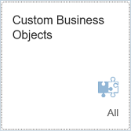

<table width=100% border=>
<tr><td colspan=2><h1>EXERCISE 01 - CREATE A CUSTOM BUSINESS OBJECT</h1></td></tr>
<tr><td><h3>SAP Partner Workshop</h3></td><td><h1> &nbsp;15 min</h1></td></tr>
</table>

## Description
In this exercise, you’ll learn how 

* to create a custom business object that has a simple data structure and publish it
* to define the data structure and create the database persistence of a custom business object

For further reading on S/4HANA cloud in-app extension, click link below.
<https://jam4.sapjam.com/groups/m8lprEZwfU3zPoX0myj1Xu/overview_page/RfBJ6ix9q00bbSseaxm4zW>

## Target group

* Developers
* People interested in learning about S/4HANA Cloud extension and SDK  

## Goal

The goal of this exercise is to create a custom business object.

## Prerequisites
  
Below are the prerequisites for this exercise.

* Google Chrome: Please complete this exercise using the Google Chrome browser
* **Authorizations:** Your user needs a business role with business catalog **Extensibility** (ID: `SAP_CORE_BC_EXT`)

## Steps

1. [Starting Custom Business Objects application](#starting-custom-business-objects-application)
1. [Creating a new Custom Business Object](#creating-a-new-custom-business-object)
1. [Defining the data structure](#defining-the-data-structure)
1. [Adding standard data to the structure](#Adding-standard-data-to-the-structure)
1. [Creating the database persistence](#creating-the-database-persistence)

###  Starting Custom Business Objects application

A several tutorials spanning example will show extensibility along custom Bonus Management applications.
As applications are based on business objects, it all starts with custom business object creation.

In the first parts a Manager wants to define business objects "Bonus Plan" for employees. A Bonus Plan is there to save employee specific rules for bonus entitlement.

**Start** with checking the prerequisite role.

1. Logon to the S/4HANA Cloud system.  The presenter will provide you the logon user and password.  The **XX** is the nuber that you have been assigned to use for the exercise. 
1. Click on the **Maintain Business Users** tile. 

	
1. Type in the User in the User Name Field and hit enter to search.  Your user will be displayed. Click on the error at the end of your user row to show the detail.   
1. On the "Assigned Business Roles" session.  Check if you have the Extensibility Business Role.  If you don't see the role, click on "Add" at the right hand side of the "Assigned Business Roles" to add the role.  
1. Search for "Extensibility".  Click on the checkbox for Extensibility and click OK.  
1. You will see the Extensibility business role added.  Click on "Save".  
1. Go back to the Launchpad Home page by clicking on the Home icon.  
1. Refresh the browser.  You will see more applications for the catalog of Extensibility.  

###  Creating a new Custom Business Object

1. **Create** the Custom Business Object's application by clicking its tile 

	
1. Press the **New** action to start creation of a Custom Business Object  
1. In the opening Pop Up **fill** in the Name "Bonus PlanXX". The other editable fields will get proposals automatically but can be changed.  

	 
1. Execute the **Create** action.

###  Defining the data structure

1. In the following view for editing the custom business object **Go to Fields and Logic** of the root node "Bonus PlanXX".   
1. Click on **New** to create new field for the object.  
1. Enter "ID" for the Naming. Choose "Numeric Identifier" for the Type. Keep 10 for the Length. Check the Key checkbox. 
1. Repeat the above 2 steps to **create** following fields by clicking on **New** for each field.

	| Field Name     | Field Properties             | Tooltip     |
	| :------------- | :--------------------------- | :-----------|
	| ID             | Numeric Identifier of length 10, key field |             |   
	| Validity Start Date | Date    | |
	| Validity End Date | Date | |   
	| Target Amount | Amount with Currency | |   
	| Low Bonus Assignment Factor | Number of length 4, decimals 2 | Actual revenue must meet target more than that many times |
	| High Bonus Assignment Factor | Number of length 4, decimals 2 | Actual revenue must meet target more than that many times |
	| Low Bonus Percentage | Quantity with Unit | |   
	| High Bonus Percentage | Quantity with Unit  | |
	| Is Consistent | Checkbox, Read Only  | |
	| Employee ID | Text of length 12  | |
	| Employee Name | Text of length 40, Read Only   | |

1. The UI for maintaining fields looks as follows. 
1. Go back via the application's **Back** button. 

	

###  Adding standard data to the structure

1. Back in the business Object's definition overview, **check** the System Administrative Data box to add standardized fields for `Created On`, `Created By`, `Last Changed On` and `Last Changed By`.  
	By checking this box the four fields also appear as uneditable in the field list.  These fields will be filled and updated automatically, so that you do not need to implement logic for this. Logic implementations for these fields even would be ignored.

###  Creating the database persistence

1. **Publish** the Business Object `Bonus PlanXX`.  
	This creates the database persistence of the Business Object.
	
1. You will **Published** in green for this object when the publishing is completed. 

## Summary
This concludes the exercise. You should have learned how to create a custom business object that has a simple data structure and publish it. At the end there will exist a database table for the business object. Please proceed with exercise 01B.
