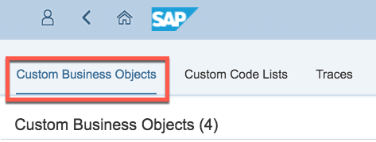
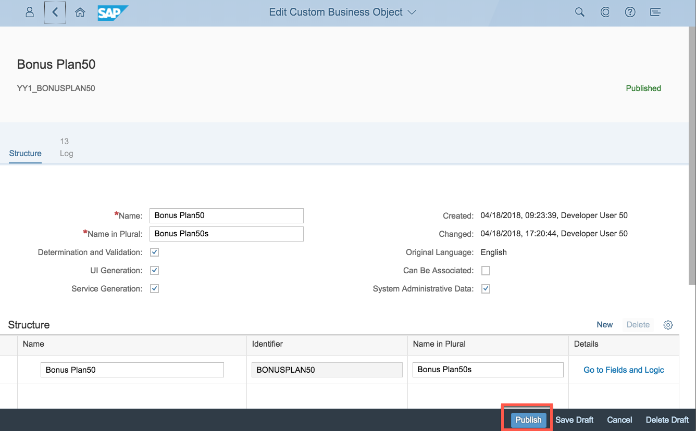
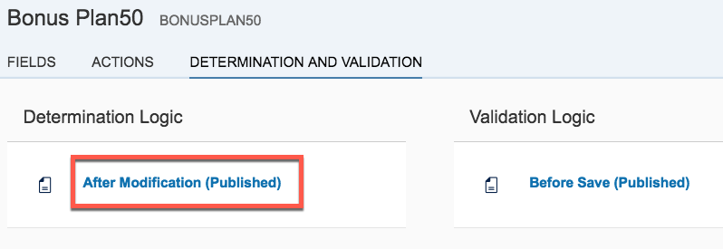
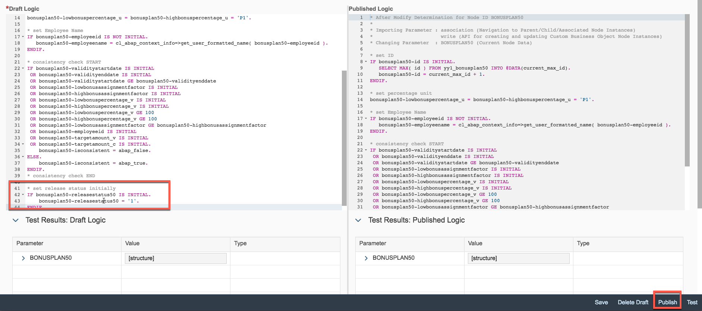
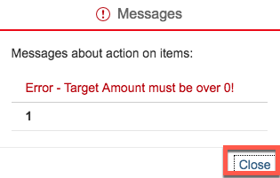
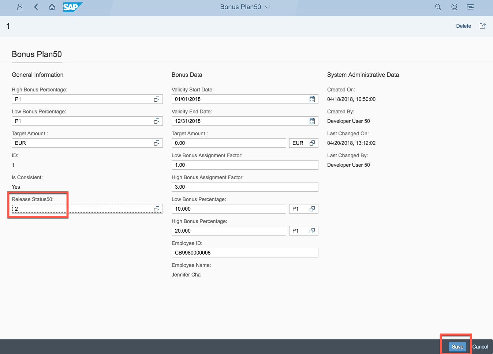
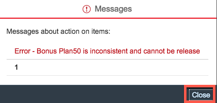
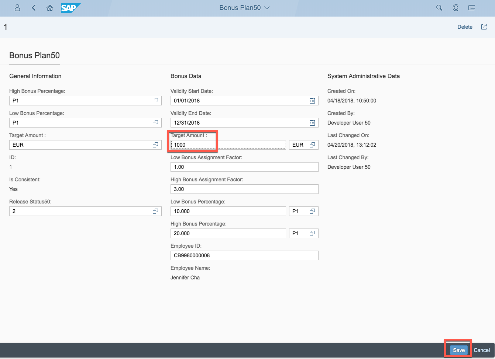
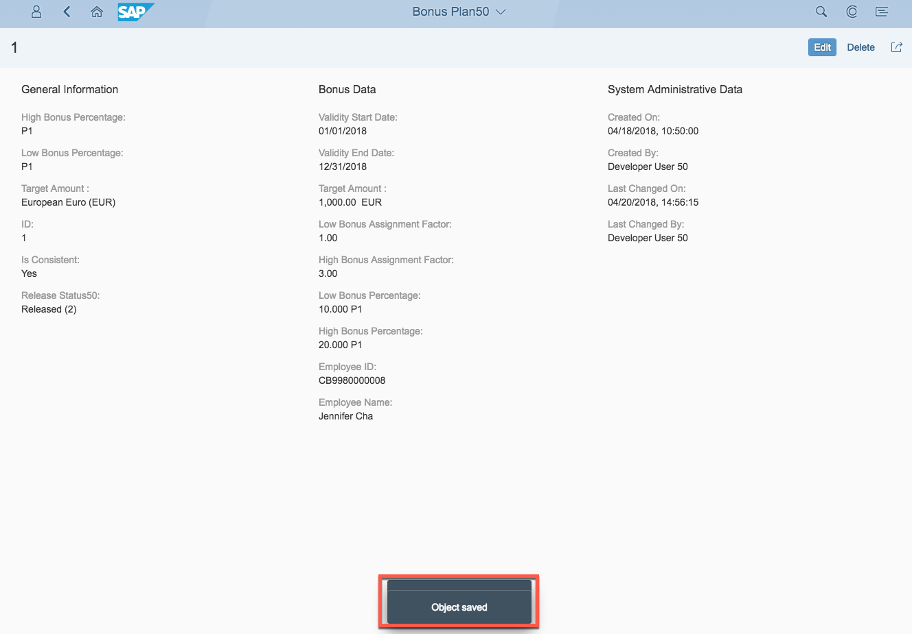

<table width=100% border=>
<tr><td colspan=2><h1>EXERCISE 1_5 - CUSTOM CODE LIST</h1></td></tr>
<tr><td><h3>SAP Partner Workshop</h3></td><td><h1> &nbsp;50 min</h1></td></tr>
</table>

## Work in Process
## Description

So far, we created a custom business object “Bonus Plan” with simple data structure, initialization and check logic and application UI. This business object is there to save employee specific rules for bonus entitlement.

In this exercise, you’ll learn how 

* to create your Custom Code List to be used in your custom Business Object. A code list for **release status** shall be used in Bonus Plan to reflect if a Bonus Plan is still under work or ready for use.


For further reading on S/4HANA cloud in-app extension, click link below.
<https://jam4.sapjam.com/groups/m8lprEZwfU3zPoX0myj1Xu/overview_page/RfBJ6ix9q00bbSseaxm4zW>


## Target group

* Developers
* People interested in learning about S/4HANA Cloud extension and SDK  


## Goal

The goal of this exercise is to create your Custom Code List to be used in your custom Business Object.


## Prerequisites
  
Below are the prerequisites for this exercise.

* Complete previous exercises.
* Google Chrome: Please complete this exercise using the Google Chrome browser
* **Authorizations:** Your user needs a business role with business catalog **Extensibility** (ID: `SAP_CORE_BC_EXT`)


## Steps

1. [Creating the Custom Code List](#creating-the-custom-code-list)
1. [Enhancing Bonus Plan structure](#enhancing-bonus-plan-structure)
1. [Enhancing Bonus Plan logic](#enhancing-bonus-plan-logic)
1. [Testing Bonus Plan](#testing-bonus-plan)

### <a name="creating-the-custom-code-list"></a> Creating the Custom Code List

1. Open Custom Business Objects application

	
1. Switch to the Custom Code List view

	
1. Start Creation process of a Code List by clicking the **New** action.
	
1. Maintain following information for the new code list.

	GENERAL INFORAMTION:
		
	| Field Caption | Field Value |
	|------------|-------------|
	| `Name` | `Release StatusXX` |
	| `Maximum Code Length` | `1` |
	
	CODE VALUES:
	
	| Code| Description|
	|------------|-------------|
	| `1` | `Not Released` |
	| `2` | `Released` |
	
	Note: XX is the number assigned to you for the exercise.

	
1. Execute action **Save and Publish**

	

### <a name="enhancing-bonus-plan-structure"></a> Enhancing Bonus Plan structure

To make use of this new code list, you first have to add it to the structure of the Bonus Plan Business Object.

1. Go back in **Custom Business Objects** application and switch to **Custom Business Objects** view.
	
	

1. Open **Bonus PlanXX**.

	

1. Press **Edit Draft** action.

	

1. “Go to Fields and Logic”.

	

1. Click the **New** field action.

	
	
1. Enter "Release StatusXX" for the Naming. Choose "Code List" for the Type. In the Code List field start typing yy1_releasestatus until the value help offers the right name to choose easily.

	

1. Go back inside the application and **Publish** the Bonus PlanXX definition.

	
	
	

### <a name="enhancing-bonus-plan-logic"></a> Enhancing Bonus Plan logic

After having added it to the Business Object structure, also the business logic has to deal with it.
In the After Modification Event, we want to find out if end user just set the bonus plan to **Released** and ensure that bonus plan’s consistency allows to leave this end user change.

####Implement After Modification

1. In **Custom Business Object** application view, search for **Bonus PlanXX** and click on detail.

	

1. Click on **Go to Fields and Logic**.

	

1. Enter the After Modification Event Logic which is a Determination Logic.

	

1. Click the **Create Draft** action.

	

1. Implement following functionality: 

	**General:**
	
	Set ReleaseStatus to “1” (Not Released) if still initial.
	
	```abap
	* set release status initially
	IF bonusplanxx-releasestatusxx IS INITIAL.
	    bonusplanxx-releasestatusxx = '1'.
	ENDIF.
	```

1. **Publish** the logic

	

1. Go back

	

####Implement Before Save

1. **Implement** Before Save event with following functionality.

	Save rejection logic should no longer be dependent on consistency; but, on release status.
	>***Hint:*** Exporting parameter valid must be set to true for save and to false for save rejection.

	- A consistent bonus plan which just got released, can be saved.
	- An inconsistent bonus plan which just got released, shall be set to “Not Released” by end user again and made consistent first.
	>***Hint:***  The release status from previous changes can be read from database
	
	- Changing and saving an already released bonus plan is not allowed.
	- A bonus plan in status “Not Released” can be saved, but first consistency error has be given back as information.
	>***Hint:*** Exporting parameter message gets automatically an information only if save is not rejected. (valid = abap_true)

1. Click on **Before Save (Published)**.

	
	
1. Click on **Create Draft**.

	
	
1. Enter the following code. Note: Replace the **XX** with your assigned number.

	```abap
	*Save rejection shall no longer be dependent on consistency but on release status.
	* decide about save rejection
	IF bonusplanXX-releasestatusXX EQ '2'.
	    SELECT SINGLE ( releasestatusXX ) FROM yy1_bonusplanXX INTO @DATA(releasestatusXX_db) WHERE id = @bonusplanXX-id.
	    IF releasestatusXX_db NE '2'.
	        IF bonusplanXX-isconsistent EQ abap_true.
	            valid = abap_true.
	            message = 'Bonus PlanXX released successfully.'.
	        ELSE.
	            valid = abap_false.
	            message = 'Bonus PlanXX is inconsistent and cannot be released. Set it back to "Not Released" and solve inconsistencies first.'.
	        ENDIF.
	    ELSE.
	        valid = abap_false.
	        message = 'Bonus PlanXX was already released before. Changes are forbidden and saving is not possible.'.
	    ENDIF.
	    RETURN.
	ELSE.
	    valid = abap_true.
	ENDIF.	
	```


	
	
1. **Publish** the logic.

	
	
### <a name="testing-bonus-plan"></a> Testing Bonus Plan

The following are the steps to test the logic implemented.

1. **Refresh** the **Home** page.

1. Open the **Bonus PlanXX** application.

	

1. Click on **Go** and display the detail of the bonus plan.

	

1. Execute the **Edit** action to start editing.

	

1. Delete the **Target Amount** value. **Save** the Bonus Plan.

	

1. Save brings error due to missing Target Amount. **Close** the pop up error message.

	


1. Choose Release Status **2** (Released). **Save** the Bonus Plan.

	

1. Save fails due to release status change while having the inconsistency of a missing target amount. **Close** the pop up error message.

	

1. Enter Target Amount 1000 again. **Save** the Bonus Plan.

	

1. Save succeeds.

	
	

## Summary
This concludes the exercise. 

You should have learned how to create your Custom Code List to be used in your custom Business Object. A code list for **release status** is used in Bonus Plan to reflect if a Bonus Plan is still under work or ready for use.

Please proceed with next exercise.
