<table width=100% border=>
<tr><td colspan=2><h1>EXERCISE 1_6 - ASSOCIATED BUSINESS OBJECTS</h1></td></tr>
<tr><td><h3>SAP Partner Workshop</h3></td><td><h1> &nbsp;40 min</h1></td></tr>
</table>

## Work in Process

## Description

Learn how to let a second Custom Business Object work with the first and a standard Business Object.
In the example a manager wants to create a Bonus Entitlement (= bonus calculation) based on sales volume.

So far, we created a simple application with custom business object “Bonus Plan” to save employee specific rules for bonus entitlement.

In this exercise, you’ll learn how 

* to create a second Custom Business Object to work with the existing one.

Example: A Manager wants to create a “Bonus Entitlement” (= bonus calculation) based on sales volume that uses data of a bonus plan.

## Target group

* Developers
* People interested in learning about S/4HANA Cloud extension and SDK  


## Goal

The goal of this exercise is to create a second Custom Business Object to work with the existing one.


## Prerequisites
  
Below are the prerequisites for this exercise.

* Complete previous exercises.
* Google Chrome: Please complete this exercise using the Google Chrome browser
* **Authorizations:** Your user needs a business role with business catalog **Extensibility** (ID: `SAP_CORE_BC_EXT`)
* Having Sales Orders in the system for the employee of the bonus plan as creator. The sales Orders where created within the validity period of the bonus plan. Their sum of Net Amount should be higher than multiplication product of bonus plan’s Target Amount and High Bonus Assignment Factor.
* To be able to create Sales Order a user needs Business Catalog `SAP_SD_BC_SO_PROC_MC`.
* To be able to complete Sales Orders a user needs Business Catalog `SAP_LE_BC_ODLV_PROC_MC`.


## Steps

1. [Creating the Business Object Bonus Entitlement](#creating-the-business-object-bonus-entitlement)
1. [Enhancing Bonus Plan structure](#enhancing-bonus-plan-structure)--
1. [Enhancing Bonus Plan logic](#enhancing-bonus-plan-logic)--
1. [Testing Bonus Plan](#testing-bonus-plan)--

### <a name="creating-the-business-object-bonus-entitlement"></a> Creating the Business Object Bonus Entitlement

Create the second Business Object, named Bonus Entitlement.

1. **Open** the Custom Business Object's application by clicking its tile  

	
	
1. Press the **New** action to start creation of a Custom Business Object  

	
	
1. In the opening pop up **fill** in the Name "Bonus EntitlementXX". Note: XX is the number assigned to you. The other editable fields will get proposals automatically but can be changed. 

	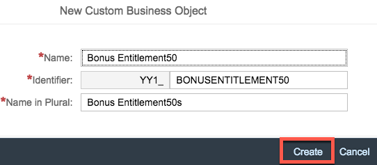 
	
1. Execute the **Create** action.

### <a name="defining-the-data-structure"></a> Defining the data structure

1. In the following view for editing the custom business object **Go to Fields and Logic** of the root node "Bonus EntitlementXX".  

	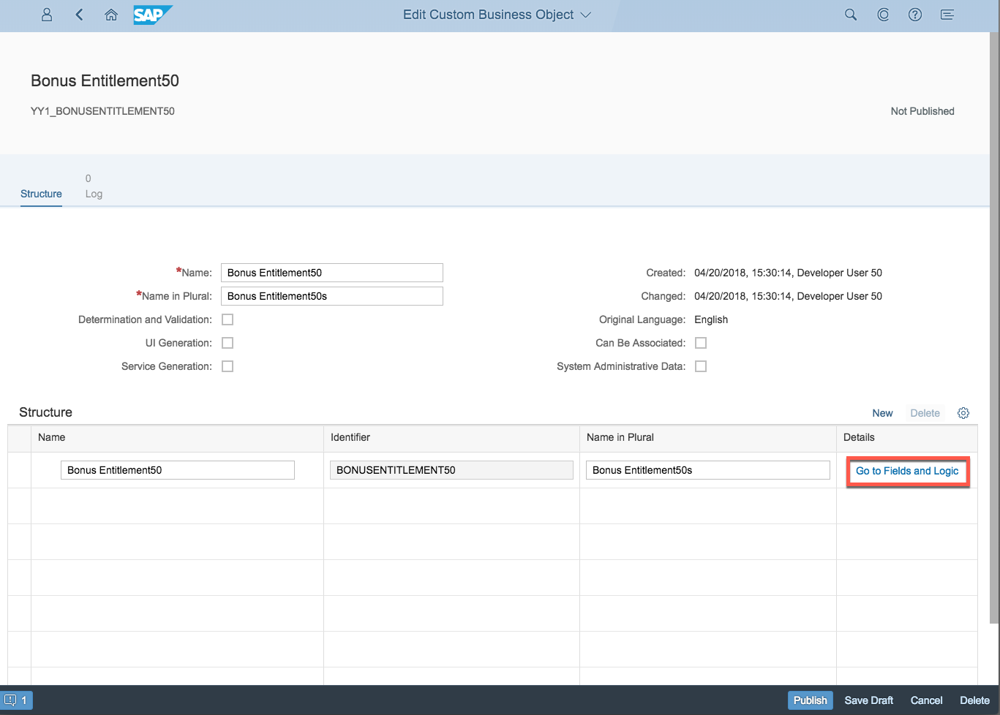 
	
1. Click on **New** to create new field for the object. 

	 
	
1. **Create** following fields.  

	| Field Name     | Field Properties             |Note | 
	| :------------- | :--------------------------- |:--------------------------- |
	| Description	             | Text of length 255 | | 
	| Calculation Start Date| Date    | | 
	| Calculation End Date | Date |  | 
	| Actual Revenue Amount | Amount | | 
	| Low Bonus Amount | Amount || 
	| High Bonus Amount| Amount || 
	| Total Bonus Amount| Amount |   | 
	| Bonus PlanXX ID | text of length 20 |Note: XX is the number assigned to you.| 


1. The UI for maintaining fields looks as follows. 

	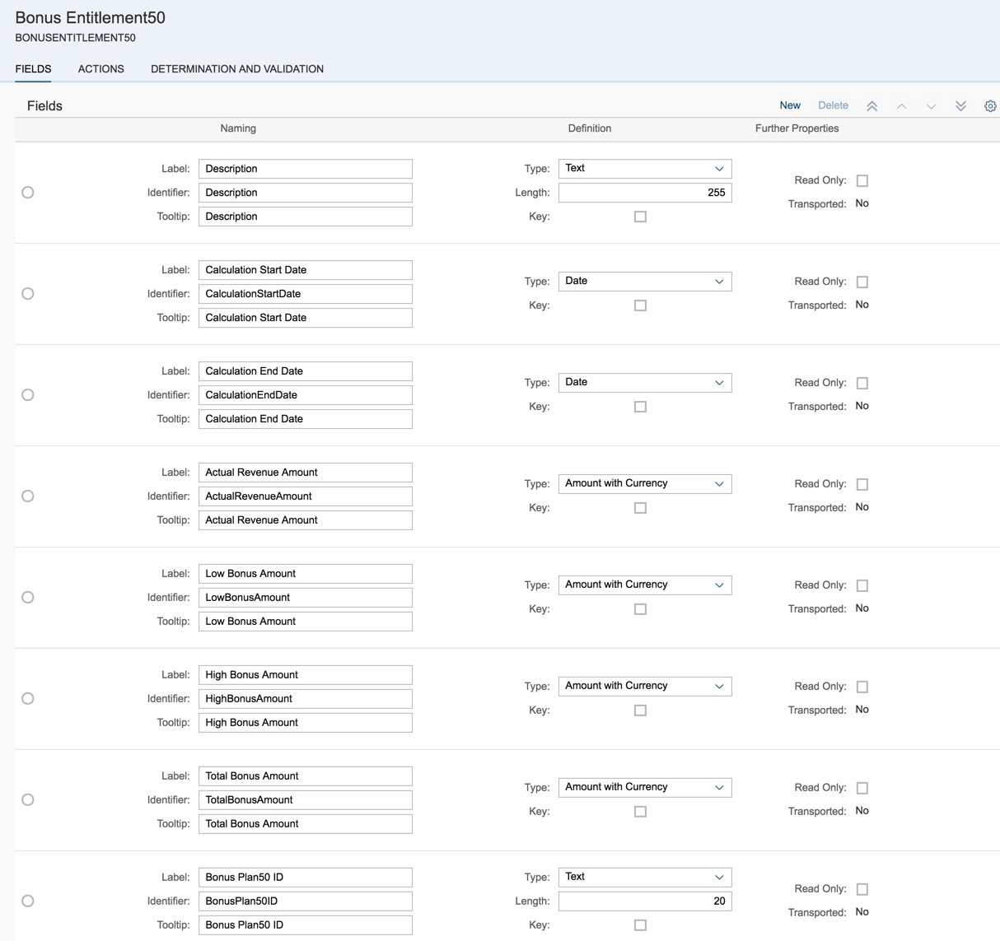 
	
1. Go back via the application's **Back** button. 

	
	
1. **Check** the "System Administrative Data", "Determination and Validation", "UI Generation", and "Service Generation". And **Publish** the business object.

	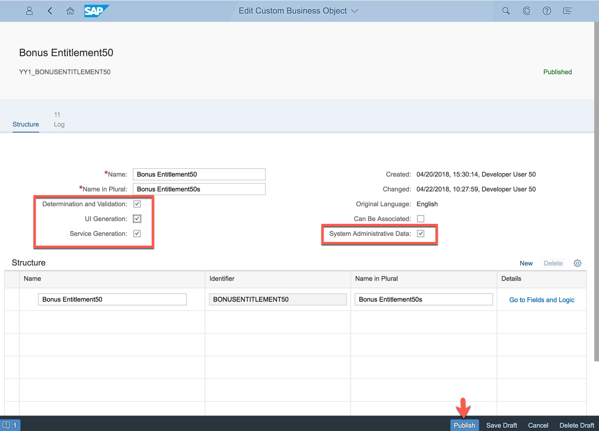 

### <a name="implementing-the-bonus-entitlement-business-logic"></a> Implementing the Bonus Entitlement’s Business logic

####After Modification

Implement After Modification event with following fix value functionality:

1. **Go to Fields and Logic**

	
1. Enter the After Modification Event Logic which is a Determination Logic.

	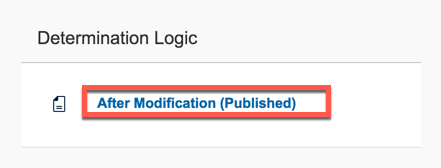
1. In the logic view you initially see the not editable empty published version. Click the **Create Draft** action.

	
1. An editable copy of the published version appears left to it. With the **Draft Version** and **Published Version** actions you can decide what coding to see. 

1. Implement following functionality

	**General**
	
	- Check preconditions for the bonus calculation

	>**Hint:** Bonus plan must be set.
	
	- Get the bonus plan data and check that it is in status “Released”

	>**Hint:**  For the SELECT the bonus plan ID must me right aligned in the text field. You can achieve that with the help of length function strln() and the SHIFT statement. When calculating the number of places that the id shall be shifted right, bear in mind that the minuend, the id length has to be subtracted from is 19 not 20 (which would be the length of the id’s text field).
	
	- Set the bonus entitlement’s calculation period equal to the bonus plan’s validity period

1. Enter the consistency check coding.
	
	```abap
	DATA: bonusplanXX TYPE yy1_bonusplanXX.
	DATA: bonusplanXX_id TYPE yy1_bonusplanXX-id.
	
	IF bonusentitlementXX-bonusplanXXid IS INITIAL.
	    RETURN.
	ELSE.
	" get Bonus Plan
	" convert bonusplanXX ID for SELECT
	    bonusplanXX_id = bonusentitlementXX-bonusplanXXid.
	    DATA: length TYPE i.
	    length = strlen( bonusentitlementXX-bonusplanXXid ).
	    SHIFT bonusplanXX_id BY ( 19 - length ) PLACES RIGHT.
	
	    SELECT *
	     FROM yy1_bonusplanXX
	     INTO @bonusplanXX
	     WHERE id EQ @bonusplanXX_id.
	    ENDSELECT.
	
	    IF bonusplanXX-releasestatusXX EQ '2'.
	"" fill calculation period (should actually be done by plan when creating entitlement)
	        bonusentitlementXX-calculationstartdate = bonusplanXX-validitystartdate.
	        bonusentitlementXX-calculationenddate = bonusplanXX-validityenddate.	```
	
####Bonus Calculation

1. Get the employee’s actual revenue from the completed Sales Orders that he created in the validity period of the bonus plan

	>**Hint:** There is the CDS view I_SalesOrderItemCube with the parameters Exchange Rate (take ‘M’) and Display Currency (should be the one from bonus plan’s target amount). This view offers the netamountindisplaycurrency which does already currency conversion
	
	>**Hint:** You need following view field to restrict the results correctly:
	
	- “createdbyuser”
	- “overallsdprocessstatus” (value “C” stands for completed)
	- “creationdate”

	
	```abap
	" get completed Sales Orders for bonus planXX's employee
	        SELECT FROM i_salesorderitemcube( p_exchangeratetype = 'M', p_displaycurrency = @bonusplanXX-targetamount_c )
	         FIELDS SUM( netamountindisplaycurrency )
	         WHERE createdbyuser = @bonusplanXX-employeeid
	          AND overallsdprocessstatus = 'C'
	          AND creationdate BETWEEN @bonusplanXX-validitystartdate AND @bonusplanXX-validityenddate
	         INTO @bonusentitlementXX-actualrevenueamount_v.
	        bonusentitlementXX-actualrevenueamount_c = bonusplanXX-targetamount_c.
	```

1. Calculate the revenue based bonus by implementing the following rules:

	- If the employee reached more than the multiplication product of Target Amount and Low Bonus Assignment Factor, he gets the Low Bonus Percentage of his revenue as Low Bonus Amount

	>**Hint:** If (ActualRevenueAmount / TargetAmount) > LowBonusAssignmentFactor, then LowBonusAmount = ActualRevenueAmount * LowBonusPercentage
	
	- If the employee reached more than the multiplication product of Target Amount and High Bonus Assignment Factor, he gets the High Bonus Percentage of his revenue above that multiplication product as High Bonus Amount additionally to the .

	>**Hint:** If (ActualRevenueAmount / TargetAmount) > HighBonusPercentage, then HighBonusAmount (ActualRevenueAmount – (TargetAmount * HighBonusAssignmentFactor)) * HighBonusPercentage.

	```abap
	" calculate minimum bonus
	        IF ( bonusentitlementXX-actualrevenueamount_v / bonusplanXX-targetamount_v ) GT bonusplanXX-lowbonusassignmentfactor.
	            bonusentitlementXX-lowbonusamount_v = bonusentitlementXX-actualrevenueamount_v * bonusplanXX-lowbonuspercentage_v / 100.
	            bonusentitlementXX-lowbonusamount_c = bonusplanXX-targetamount_c.
	        ELSE.
	            CLEAR bonusentitlementXX-lowbonusamount_v.
	            CLEAR bonusentitlementXX-lowbonusamount_c.
	        ENDIF.
	
	" calculate maximum bonus
	        IF ( bonusentitlementXX-actualrevenueamount_v / bonusplanXX-targetamount_v ) GT bonusplanXX-highbonusassignmentfactor.
	            bonusentitlementXX-highbonusamount_v = ( bonusentitlementXX-actualrevenueamount_v - ( bonusplanXX-targetamount_v * bonusplanXX-highbonusassignmentfactor ) ) *  bonusplanXX-highbonuspercentage_v / 100.
	            bonusentitlementXX-highbonusamount_c = bonusplanXX-targetamount_c.
	        ELSE.
	            CLEAR bonusentitlementXX-highbonusamount_v.
	            CLEAR bonusentitlementXX-highbonusamount_c.
	        ENDIF.	
	```

1. Sum the different bonuses to the Total one.
1. For information write bonus plan data into the description

	```abap
	" calculate total bonus
	        bonusentitlementXX-totalbonusamount_v = bonusentitlementXX-lowbonusamount_v + bonusentitlementXX-highbonusamount_v.
	        bonusentitlementXX-totalbonusamount_c = bonusplanXX-targetamount_c.
	
	        DATA(actrevenue_s) = CONV string( bonusentitlementXX-actualrevenueamount_v ).
	        DATA(target_s) = CONV string( bonusplanXX-targetamount_v ).
	        DATA(lowf_s) = CONV string( bonusplanXX-lowbonusassignmentfactor ).
	        DATA(lowp_s) = CONV string( bonusplanXX-lowbonuspercentage_v ).
	        DATA(highf_s) = CONV string( bonusplanXX-highbonusassignmentfactor ).
	        DATA(highp_s) = CONV string( bonusplanXX-highbonuspercentage_v ).
	        CONCATENATE 'Bonus Run for Plan: ' bonusentitlementXX-bonusplanXXid
	                    ' with Target Amount: ' target_s
	                    ', Low Factor: ' lowf_s
	                    ', Low Percentage: ' lowp_s
	                    ', High Factor: ' highf_s
	                    ', High Percentage: ' highp_s INTO bonusentitlementXX-description SEPARATED BY space.
	    ELSE.
	        RETURN.
	    ENDIF.
	ENDIF.
	```

1. The complete coding for after modification is below.

	```abap
	* After Modify Determination for Node ID BONUSENTITLEMENT50
	*
	* Importing Parameter : association (Navigation to Parent/Child/Associated Node Instances)
	*                       write (API for creating and updating Custom Business Object Node Instances)
	* Changing Parameter  : BONUSENTITLEMENT50 (Current Node Data)
	
	DATA: bonusplan50 TYPE yy1_bonusplan50.
	DATA: bonusplan50_id TYPE yy1_bonusplan50-id.
	
	IF bonusentitlement50-bonusplan50id IS INITIAL.
	    RETURN.
	ELSE.
	" get Bonus Plan
	" convert bonusplan50 ID for SELECT
	    bonusplan50_id = bonusentitlement50-bonusplan50id.
	    DATA: length TYPE i.
	    length = strlen( bonusentitlement50-bonusplan50id ).
	    SHIFT bonusplan50_id BY ( 19 - length ) PLACES RIGHT.
	
	    SELECT *
	     FROM yy1_bonusplan50
	     INTO @bonusplan50
	     WHERE id EQ @bonusplan50_id.
	    ENDSELECT.
	
	    IF bonusplan50-releasestatus50 EQ '2'.
	"" fill calculation period (should actually be done by plan when creating entitlement)
	        bonusentitlement50-calculationstartdate = bonusplan50-validitystartdate.
	        bonusentitlement50-calculationenddate = bonusplan50-validityenddate.
	
	" get completed Sales Orders for bonus plan50's employee
	        SELECT FROM i_salesorderitemcube( p_exchangeratetype = 'M', p_displaycurrency = @bonusplan50-targetamount_c )
	         FIELDS SUM( netamountindisplaycurrency )
	         WHERE createdbyuser = @bonusplan50-employeeid
	          AND overallsdprocessstatus = 'C'
	          AND creationdate BETWEEN @bonusplan50-validitystartdate AND @bonusplan50-validityenddate
	         INTO @bonusentitlement50-actualrevenueamount_v.
	        bonusentitlement50-actualrevenueamount_c = bonusplan50-targetamount_c.
	        
	" calculate minimum bonus
	        IF ( bonusentitlement50-actualrevenueamount_v / bonusplan50-targetamount_v ) GT bonusplan50-lowbonusassignmentfactor.
	            bonusentitlement50-lowbonusamount_v = bonusentitlement50-actualrevenueamount_v * bonusplan50-lowbonuspercentage_v / 100.
	            bonusentitlement50-lowbonusamount_c = bonusplan50-targetamount_c.
	        ELSE.
	            CLEAR bonusentitlement50-lowbonusamount_v.
	            CLEAR bonusentitlement50-lowbonusamount_c.
	        ENDIF.
	
	" calculate maximum bonus
	        IF ( bonusentitlement50-actualrevenueamount_v / bonusplan50-targetamount_v ) GT bonusplan50-highbonusassignmentfactor.
	            bonusentitlement50-highbonusamount_v = ( bonusentitlement50-actualrevenueamount_v - ( bonusplan50-targetamount_v * bonusplan50-highbonusassignmentfactor ) ) *  bonusplan50-highbonuspercentage_v / 100.
	            bonusentitlement50-highbonusamount_c = bonusplan50-targetamount_c.
	        ELSE.
	            CLEAR bonusentitlement50-highbonusamount_v.
	            CLEAR bonusentitlement50-highbonusamount_c.
	        ENDIF.
	
	" calculate total bonus
	        bonusentitlement50-totalbonusamount_v = bonusentitlement50-lowbonusamount_v + bonusentitlement50-highbonusamount_v.
	        bonusentitlement50-totalbonusamount_c = bonusplan50-targetamount_c.
	
	        DATA(actrevenue_s) = CONV string( bonusentitlement50-actualrevenueamount_v ).
	        DATA(target_s) = CONV string( bonusplan50-targetamount_v ).
	        DATA(lowf_s) = CONV string( bonusplan50-lowbonusassignmentfactor ).
	        DATA(lowp_s) = CONV string( bonusplan50-lowbonuspercentage_v ).
	        DATA(highf_s) = CONV string( bonusplan50-highbonusassignmentfactor ).
	        DATA(highp_s) = CONV string( bonusplan50-highbonuspercentage_v ).
	        CONCATENATE 'Bonus Run for Plan: ' bonusentitlement50-bonusplan50id
	                    ' with Target Amount: ' target_s
	                    ', Low Factor: ' lowf_s
	                    ', Low Percentage: ' lowp_s
	                    ', High Factor: ' highf_s
	                    ', High Percentage: ' highp_s INTO bonusentitlement50-description SEPARATED BY space.
	    ELSE.
	        RETURN.
	    ENDIF.
	ENDIF.
	```

1. **Publish** the After Modification.

	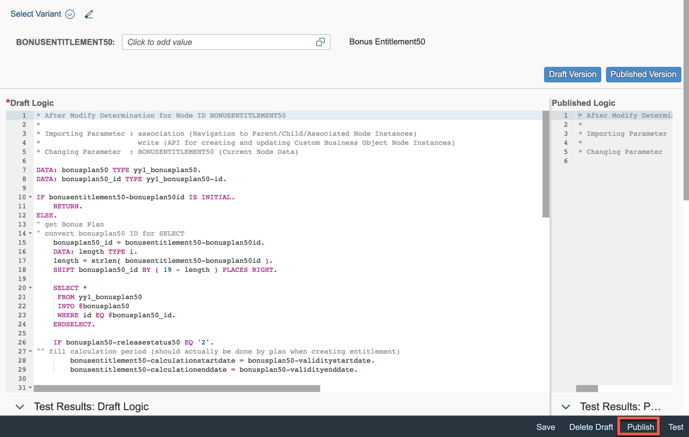

1. Go back.

	


### <a name="implement-before-save"></a> Implement Before Save

1. **Implement** Before Save event with following functionality

	- Implement a check that the Bonus entitlement is unique, which means the only one for the associated bonus plan.

	>**Hint:** as there’s no direct connection between plan and entitlement on plan’s side, make use of the fact, that there can be only one entitlement with the current one’s and that must have the same creation point in time	

1. Click on **Before Save (Published)**.

	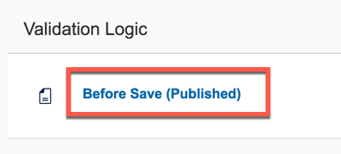
	
1. Click on **Create Draft**.

	

1. Enter the following:

	```abap
	valid = abap_false.
	
	* check for consistency
	DATA: bonusplanXX TYPE yy1_bonusplanXX.
	DATA: bonusplanXX_id TYPE yy1_bonusplanXX-id.
	
	IF bonusentitlementXX-bonusplanXXid IS INITIAL.
	    message = 'No Bonus Plan set. Bonus calculation impossible.'.
	    RETURN.
	ELSE.
	* check for uniqueness
	    SELECT SINGLE @abap_true FROM yy1_bonusentitlementXX INTO @DATA(rv_exists) WHERE bonusplanXXid EQ @bonusentitlementXX-bonusplanXXid
	     AND sap_createddatetime NE @bonusentitlementXX-sap_createddatetime.
	
	    IF rv_exists EQ abap_true.
	        CONCATENATE 'Bonus Entitlement for Bonus Plan ' bonusentitlementXX-bonusplanXXid 'already exists' INTO message SEPARATED BY SPACE.
	        RETURN.
	    ELSE.
	" get Bonus Plan
	" convert bonusplanXX ID for SELECT
	        bonusplanXX_id = bonusentitlementXX-bonusplanXXid.
	        DATA: length TYPE i.
	        length = strlen( bonusentitlementXX-bonusplanXXid ).
	        SHIFT bonusplanXX_id BY ( 19 - length ) PLACES RIGHT.
	
	        SELECT *
	         FROM yy1_bonusplanXX
	         INTO @bonusplanXX
	         WHERE id EQ @bonusplanXX_id.
	        ENDSELECT.
	
	        IF bonusplanXX IS INITIAL.
	            CONCATENATE 'Bonus Plan ' bonusentitlementXX-bonusplanXXid 'does not exist. Bonus calculation impossible.' INTO message SEPARATED BY SPACE.
	            RETURN.
	        ELSEIF bonusplanXX-releasestatusXX NE '2'.
	            CONCATENATE 'Bonus Plan ' bonusentitlementXX-bonusplanXXid 'is not released. Bonus calculation not allowed yet.' INTO message SEPARATED BY SPACE.
	            RETURN.
	        ENDIF.
	        message = 'Bonus calculated' .
	        valid = abap_true.
	    ENDIF.
	ENDIF.
	```

1. If the bonus plan is not consistent, write the first found error into the message and end the logic processing.
These are the possible errors in detail:
      - `ValidityStartDate` and `ValidityEndDate` must be set
      - `ValidityStartDate` must be earlier in time than `ValidityEndDate`
      - Factors and Percentages must be > 0
      - Percentages must be < 100
      - LowBonusAssignmentFactor must be < HighBonusAssignmentFactor
      - Empoyee ID must be set

	```abap
	* consistency error message START

	* consistency error message  END
	```

1. **Publish** the Before Save Logic.

	
	
1. Go back and check both After Modication and Before Save are Published.

		
		
1. Go Back.

		
	
### <a name="maintain-catalog"></a> Maintain Catalog

1. Go to Custom Catalog Extension application by clicking the **Maintain Catalog** action. 

	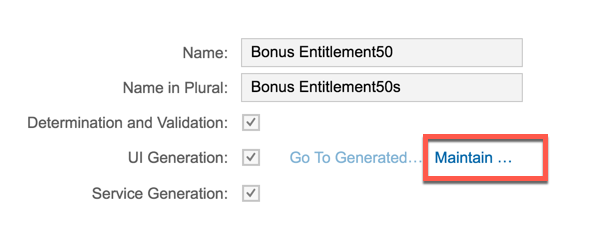
	
1. A new window will open. Start adding a catalog with the **Add** action.

	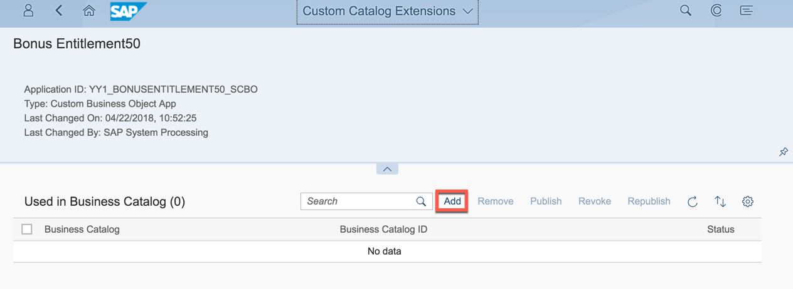
	
1. In the opening value help narrow down the result list by searching for **Extensibility**, select the Catalog with role ID `SAP_CORE_BC_EXT` and press **OK**.

	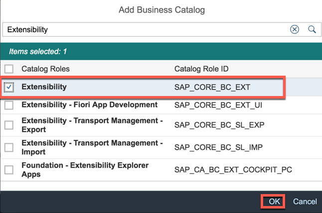
	
1. Select the just added Catalog and **publish** it.

	
	
1. Click on **OK** for confirmation.
 
	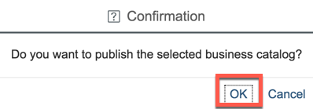

1. This step takes some minutes, the screen refreshes automatically and once the status switches from unpublished to **published**, you can close this application’s window and proceed.
	
	
	
1. Back in the Custom Business Object application’s window, go to the SAP Fiori Launchpad via **Home** action.

		
	
### <a name="test-via-the-UI"></a> Test via the UI

Once ensured that both logic implementations were successfully published, you can start testing the Application like an end user via the UI.

1. **Refresh** the Browser window with key F5 for that the catalog extension becomes visible.

1. **Open** the Bonus EntitlementXXs application. 

	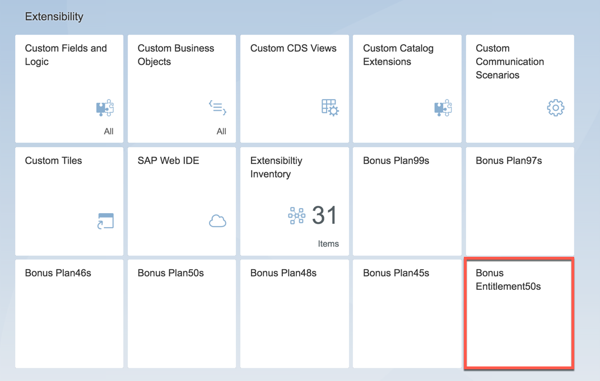
	
1. Create an object.

	
	
1. Enter value `1` for Bonus PlanXX ID. Save the Bonus Entitlement. 

	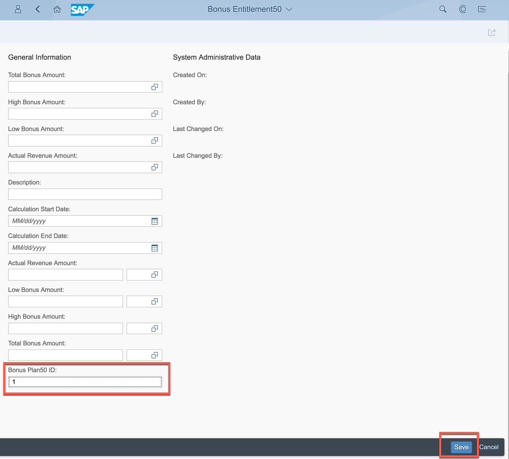
	
1. All Data of the Entitlement will get filled.

	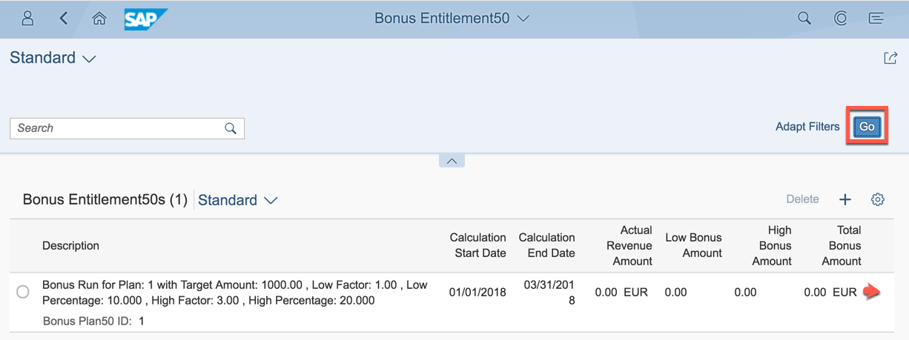
	
	
## Summary
This concludes the exercise. 

You should have learned how to let a second Custom Business Object work with the first and a standard Business Object.  In the example a manager wants to create a Bonus Entitlement (= bonus calculation) based on sales volume.

Please proceed with next exercise.
