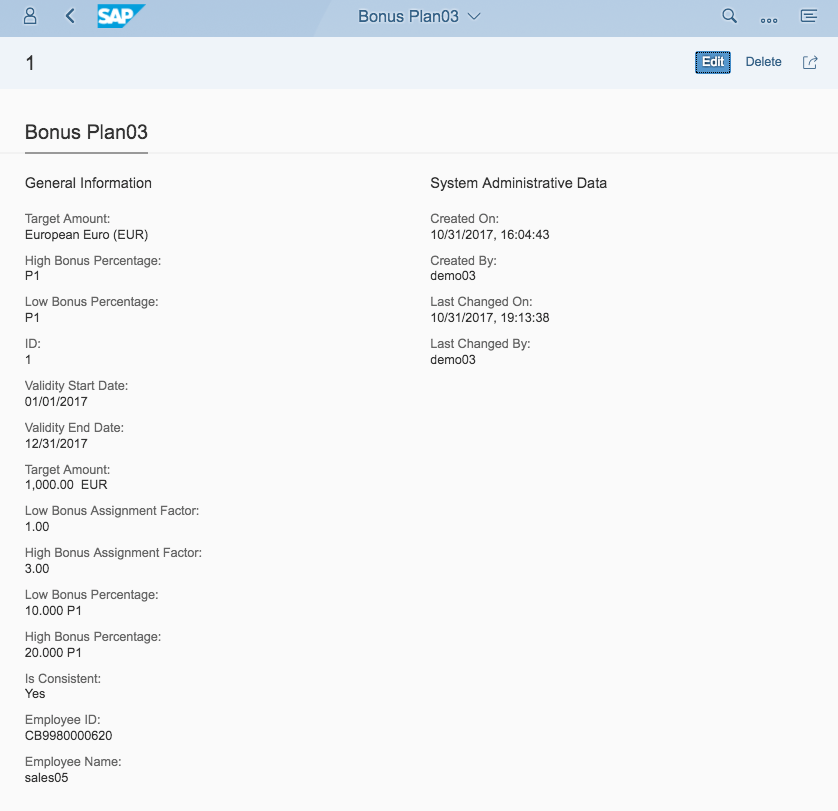
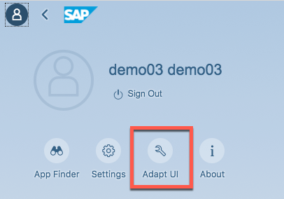
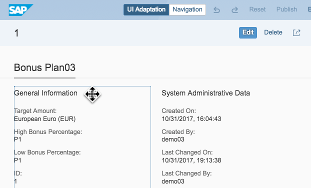
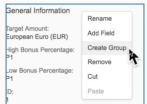
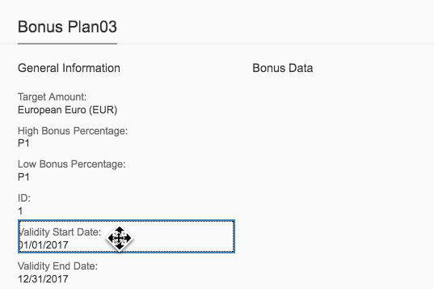
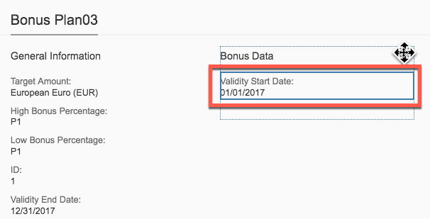
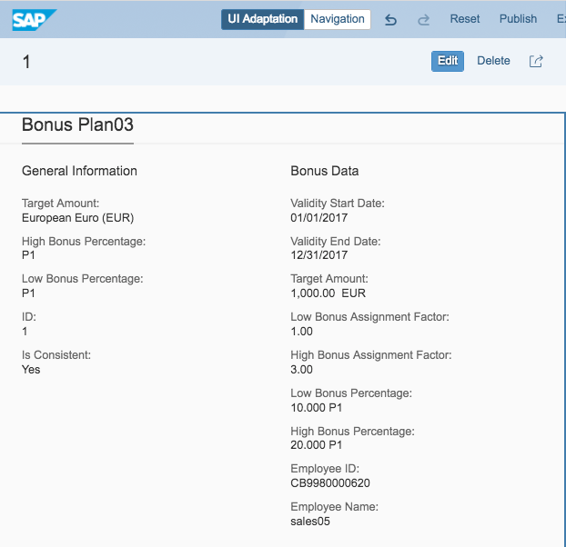

<table width=100% border=>
<tr><td colspan=2><h1>EXERCISE 03 - ADAPTING THE UI OF A BUSINESS OBJECT</h1></td></tr>
<tr><td><h3>SAP Partner Workshop</h3></td><td><h1> &nbsp;15 min</h1></td></tr>
</table>

## Description
In this exercise, you’ll learn how 

* to create a custom business object that has a simple data structure and publish it
* to define the data structure and create the database persistence of a custom business object

For further reading on S/4HANA cloud in-app extension, click link below.
<https://jam4.sapjam.com/groups/m8lprEZwfU3zPoX0myj1Xu/overview_page/RfBJ6ix9q00bbSseaxm4zW>

## Target group

* Developers
* People interested in learning about S/4HANA Cloud extension and SDK  

## Goal

The goal of this exercise is to adapt the generated UI of a custom business object.

## Prerequisites
  
Below are the prerequisites for this exercise.

* Google Chrome: Please complete this exercise using the Google Chrome browser
* **Authorizations:** Your user needs a business role with business catalog **Extensibility** (ID: `SAP_CORE_BC_EXT`)

## Steps

1. [Open the UI to be adapted](#open-the-ui-to-be-adapted)
1. [Switch to Adaptation mode](#switch-to-adaptation-mode)
1. [Create an UI group](#create-an-ui-group)
1. [Move UI elements](#move-ui-elements)
1. [Apply UI changes](#apply-ui-changes)

###  Open the UI to be adapted

A several tutorials spanning example will show extensibility along custom Bonus Management applications.

In the first parts a Manager wants to define business objects "Bonus Plan" for employees. 

1. Open the **Bonus PlansXX** application in Fiori Launchpad group **Extensibility**.  XX is the number assigned to you for the exercise.

	
1. Press **Go** to get the list of all Bonus Plans. **Open** a bonus plan's detail view.

	

	This is the screen that will be adapted.
	
	

###  Switch to Adaptation mode

1. **Open User Settings** via the corresponding application's menu action

	

	Open the adaptation mode via **Adapt UI**.
	
	  

###  Create an UI group

1. Editable UI elements can be recognized by getting a dashed border and the movement cursor when hovering over them.

	

1. By right clicking onto them you get options to adapt the UI. As these options are partly type dependent you might need to find the right element first to get the option you need.

1. **Hover** over the **General Information** area until it gets the dashed border and open the context menu via **Right Click**.

	
1. **Create Group** and name it "Bonus Data". 

	 

###  Move UI elements

1. Editable fields can simply be dragged and dropped as well. **Drag** the Validity Start Date field.

	

1. **Drop** it to the Bonus Data group.

	 

	Repeat **Drag & Drop** into Bonus Data group for the fields:

	- Validity End Date
	- Target Amount
	- Low Bonus Assignment Factor
	- High Bonus Assignment Factor
	- Low Bonus Percentage
	- High Bonus Percentage
	- Employee ID
	- Employee Name

	

###  Apply UI changes

1. **Publish** the UI adaptations.

	

1. Finally you only need to **Exit** adaptation mode to work with the new layout.

	

## Summary
This concludes the exercise. 

In the preceding tutorials you created a custom business object with a simple data structure and its persistence. Afterwards you generated an UI for this business object and exposed it as an Fiori Launchpad application.
As the generated User Interfaces only list all fields of a business object node, adapting the UI might be necessary to improve usability of it.

You should have learned how to adapt the generated UI of a custom business object. 

Please proceed with exercise 04.
